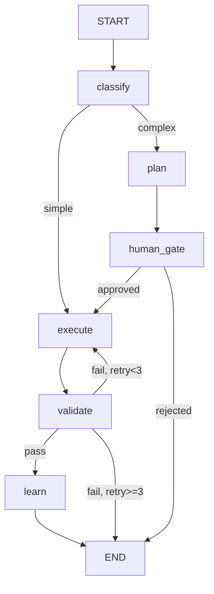

# LangGraph Orchestrator Definitions

> Graph topology, state schemas, and visual documentation for the factory DAG.

## Purpose

This directory holds the **conceptual** graph definitions and documentation. The executable Python code lives in `src/factory/orchestrator/`. This directory is for:

1. Visual graph diagrams (Mermaid/ASCII)
2. State transition documentation
3. Node contract specifications

## Factory DAG (Current Design)

## Node Contracts

| Node | Input | Output | Side Effects |
|---|---|---|---|
| `classify` | task_description, domain | metadata, routing, context_bundle | None |
| `plan` | context_bundle, task_description | plan artifacts (proposal.md, tasks.md) | Writes to openspec/changes/ |
| `human_gate` | plan artifacts | approval status | Pauses workflow |
| `execute` | context, routing, constraints | modified_files, result | Writes code via OpenCode |
| `validate` | modified_files, domain | test_results | Runs build + tests |
| `learn` | modified_files, result | patterns | Writes to Codebase Memory |

## State Schema

See `src/factory/orchestrator/state.py` for the TypedDict definition.

Key fields:
- `task_id` — unique identifier
- `status` — current workflow state
- `metadata` — classification result
- `routing` — model selection decision
- `context_bundle` — injected context (Tier 1-4)
- `modified_files` — files changed by execution
- `error` — failure details (if any)
